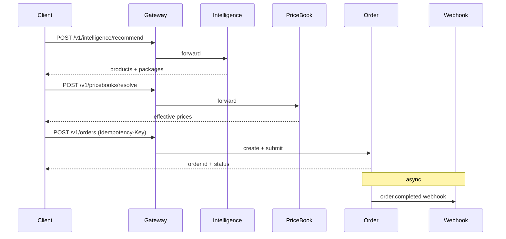

# ConveyX API Reference (Outline)

**Version:** 1.0 (POC)  
**OpenAPI version:** 3.1  
**Base URL:** `https://api.conveyx.com.au/v1` (production) · `http://localhost:3000/v1` (POC gateway)

**Related docs:** [PRD](./PRD.md) · [Architecture](./ARCHITECTURE.md)

This document is the **endpoint outline** for all ConveyX microservices. Each service will publish its own full OpenAPI 3.1 spec; the API gateway aggregates them at `GET /v1/openapi.json`.

---

## 1. Global Conventions

### 1.1 Authentication

| Client | Method |
|--------|--------|
| **Customer / Admin portals** | Supabase Auth → JWT Bearer token |
| **Public API consumers** | OAuth2 client credentials → JWT Bearer token |

**Required headers (authenticated requests):**

```
Authorization: Bearer <jwt>
X-Request-Id: <uuid>          # optional; generated if omitted
Idempotency-Key: <uuid>         # required on POST that create orders/transactions
```

**JWT claims used by services:**

```json
{
  "sub": "user-uuid",
  "entity_id": "entity-uuid",
  "entity_type": "master | branch",
  "roles": ["entity_user", "entity_admin"],
  "team_ids": ["team-uuid"]
}
```

### 1.2 Versioning

- All paths prefixed with `/v1/`
- Breaking changes → new major version (`/v2/`)
- Deprecation signalled via `Sunset` response header

### 1.3 Standard Response Envelope

**Success:**

```json
{
  "data": { },
  "meta": {
    "request_id": "uuid",
    "timestamp": "2026-08-29T10:00:00Z"
  }
}
```

**Paginated list:**

```json
{
  "data": [ ],
  "meta": {
    "request_id": "uuid",
    "page": 1,
    "page_size": 20,
    "total": 142
  }
}
```

**Error:**

```json
{
  "error": {
    "code": "VALIDATION_ERROR",
    "message": "Human-readable message",
    "details": [
      { "field": "sku", "message": "SKU already exists" }
    ]
  },
  "meta": { "request_id": "uuid" }
}
```

| HTTP status | When |
|-------------|------|
| `400` | Validation error |
| `401` | Missing or invalid token |
| `403` | Insufficient role / wrong entity |
| `404` | Resource not found |
| `409` | Conflict (duplicate SKU, idempotency replay) |
| `422` | Business rule violation |
| `429` | Rate limit exceeded |
| `500` | Internal error |

### 1.4 Common Query Parameters (lists)

| Param | Type | Description |
|-------|------|-------------|
| `page` | integer | Page number (default 1) |
| `page_size` | integer | Items per page (default 20, max 100) |
| `sort` | string | e.g. `created_at:desc` |

### 1.5 Gateway Route Map

| Gateway path prefix | Backend service | Port (POC) |
|--------------------|-----------------|------------|
| `/v1/auth/*`, `/v1/users/*`, `/v1/teams/*` | identity-service | 3001 |
| `/v1/entities/*` | customer-service | 3002 |
| `/v1/products/*`, `/v1/providers/*`, `/v1/required-data/*`, `/v1/packages/*`, `/v1/councils/*` | sku-service | 3003 |
| `/v1/intelligence/*` | catalog-intelligence-service | 3004 |
| `/v1/pricebooks/*` | pricebook-service | 3005 |
| `/v1/promotions/*` | promotion-service | 3006 |
| `/v1/orders/*` | order-service | 3007 |
| `/v1/fulfillment/*` | fulfillment-service | 3008 |
| `/v1/transactions/*`, `/v1/invoices/*`, `/v1/billing/*` | billing-service | 3009 |
| `/v1/crm/*`, `/v1/contracts/*`, `/v1/customer-groups/*` | crm-service | 3010 |
| `/v1/documents/*` | document-service | 3011 |
| `/v1/notifications/*`, `/v1/webhooks/*` | notification-service | 3012 |

---

## 2. Identity Service

**Base path:** `/v1`  
**Tag:** `Identity`  
**Roles:** All authenticated users; admin endpoints require `conveyx_admin` or `entity_admin`

### Auth

| Method | Path | Summary | Auth |
|--------|------|---------|------|
| `POST` | `/auth/signup` | Register user (delegates to Supabase Auth) | Public |
| `POST` | `/auth/login` | Login; returns JWT with enriched claims | Public |
| `POST` | `/auth/logout` | Invalidate session | Bearer |
| `POST` | `/auth/refresh` | Refresh token | Bearer |
| `POST` | `/auth/forgot-password` | Send reset email | Public |
| `POST` | `/auth/reset-password` | Reset password with token | Public |

### Users

| Method | Path | Summary | Auth |
|--------|------|---------|------|
| `GET` | `/users/me` | Current user profile + roles + teams | Bearer |
| `PATCH` | `/users/me` | Update own profile | Bearer |
| `GET` | `/users` | List users in entity | `entity_admin` |
| `POST` | `/users` | Invite/create user under entity | `entity_admin` |
| `GET` | `/users/{userId}` | Get user by ID | `entity_admin` |
| `PATCH` | `/users/{userId}` | Update user | `entity_admin` |
| `DELETE` | `/users/{userId}` | Deactivate user | `entity_admin` |

### Teams

| Method | Path | Summary | Auth |
|--------|------|---------|------|
| `GET` | `/teams` | List teams for entity | Bearer |
| `POST` | `/teams` | Create team | `entity_admin` |
| `GET` | `/teams/{teamId}` | Get team | Bearer |
| `PATCH` | `/teams/{teamId}` | Update team | `entity_admin` |
| `DELETE` | `/teams/{teamId}` | Delete team | `entity_admin` |
| `POST` | `/teams/{teamId}/members` | Add user to team | `entity_admin` |
| `DELETE` | `/teams/{teamId}/members/{userId}` | Remove user from team | `entity_admin` |

### Roles

| Method | Path | Summary | Auth |
|--------|------|---------|------|
| `GET` | `/users/{userId}/roles` | List role assignments | `entity_admin` |
| `PUT` | `/users/{userId}/roles` | Replace role assignments | `entity_admin` |

**Key schemas:**

```yaml
User:
  properties:
    id: { type: string, format: uuid }
    email: { type: string, format: email }
    first_name: { type: string }
    last_name: { type: string }
    entity_id: { type: string, format: uuid }
    status: { enum: [active, inactive] }
    team_ids: { type: array, items: { type: string, format: uuid } }
    roles: { type: array, items: { type: string } }

Team:
  properties:
    id: { type: string, format: uuid }
    entity_id: { type: string, format: uuid }
    name: { type: string }
    description: { type: string }
```

---

## 3. Customer Service

**Base path:** `/v1/entities`  
**Tag:** `Customer`

| Method | Path | Summary | Auth |
|--------|------|---------|------|
| `GET` | `/entities` | List entities (ConveyX admin) or own entity tree | `conveyx_admin` / Bearer |
| `POST` | `/entities` | Create master or branch entity | `conveyx_admin` |
| `GET` | `/entities/{entityId}` | Get entity details | Bearer (same entity or admin) |
| `PATCH` | `/entities/{entityId}` | Update entity | `entity_admin` / `conveyx_admin` |
| `GET` | `/entities/{entityId}/settings` | Get billing prefs, Stripe customer ID | `entity_admin` / `entity_billing` |
| `PATCH` | `/entities/{entityId}/settings` | Update billing preference, invoice email | `entity_admin` |
| `GET` | `/entities/{entityId}/branches` | List branch accounts (reseller master) | `entity_admin` |
| `POST` | `/entities/{entityId}/branches` | Create branch under master | `conveyx_admin` / reseller admin |

**Key schemas:**

```yaml
Entity:
  properties:
    id: { type: string, format: uuid }
    name: { type: string }
    entity_type: { enum: [master, branch] }
    parent_entity_id: { type: string, format: uuid, nullable: true }
    abn: { type: string, nullable: true }
    status: { enum: [active, suspended] }

EntitySettings:
  properties:
    entity_id: { type: string, format: uuid }
    billing_preference: { enum: [invoice, card] }
    billing_cycle: { enum: [weekly, fortnightly, monthly], nullable: true }
    payment_terms_days: { type: integer, default: 14 }
    stripe_customer_id: { type: string, nullable: true }
    invoice_email: { type: string, format: email }
```

---

## 4. SKU Service

**Base path:** `/v1`  
**Tag:** `Catalog`  
**Roles:** Read = Bearer; Write = `conveyx_admin`

### Products

| Method | Path | Summary | Auth |
|--------|------|---------|------|
| `GET` | `/products` | List/filter products | Bearer |
| `POST` | `/products` | Provision new product | `conveyx_admin` |
| `GET` | `/products/{productId}` | Get product by ID | Bearer |
| `GET` | `/products/by-sku/{sku}` | Get product by SKU code | Bearer |
| `PATCH` | `/products/{productId}` | Update product | `conveyx_admin` |
| `POST` | `/products/{productId}/activate` | Set status → active | `conveyx_admin` |
| `POST` | `/products/{productId}/deprecate` | Set status → deprecated | `conveyx_admin` |

**Query params (`GET /products`):**

| Param | Type | Description |
|-------|------|-------------|
| `state` | enum | `QLD`, `VIC`, `NSW`, `SA`, `WA`, `NT`, `ACT`, `TAS` |
| `type` | enum | `LGA`, `BodyCorp`, `LandInfo`, `State_government`, `Utility`, `Other` |
| `council` | string | Council code or `ALL` |
| `display_on_ui` | boolean | Filter portal-visible products |
| `status` | enum | `draft`, `active`, `deprecated` |
| `search` | string | Search product_name or sku |

**Request body (`POST /products`):**

```yaml
CreateProductRequest:
  required: [product_name, sku, state, type, council, provider_id, cost, retail_price, gst_option, fulfillment_method]
  properties:
    product_name: { type: string }
    sku: { type: string }
    state: { enum: [QLD, VIC, NSW, SA, WA, NT, ACT, TAS] }
    type: { enum: [LGA, BodyCorp, LandInfo, State_government, Utility, Other] }
    display_on_ui: { type: boolean, default: true }
    description: { type: string }
    council: { type: string, description: "Council code or ALL" }
    provider_id: { type: string, format: uuid }
    required_data_buyer: { type: array, items: { type: integer }, example: [1, 3, 4] }
    required_data_seller: { type: array, items: { type: integer }, example: [2, 5] }
    cost: { type: number, format: decimal }
    retail_price: { type: number, format: decimal }
    gst_option: { enum: [no_gst, normal_gst_10, fixed_gst_percent, fixed_gst_amount] }
    gst_amount: { type: number, format: decimal, nullable: true }
    fulfillment_method: { enum: [API, Automation, Manual] }
```

**Response (`Product`):**

```yaml
Product:
  allOf:
    - $ref: '#/CreateProductRequest'
    - properties:
        id: { type: string, format: uuid }
        status: { enum: [draft, active, deprecated] }
        created_at: { type: string, format: date-time }
        updated_at: { type: string, format: date-time }
```

### Providers

| Method | Path | Summary | Auth |
|--------|------|---------|------|
| `GET` | `/providers` | List/search providers (typeahead) | Bearer |
| `POST` | `/providers` | Create provider (inline from product form) | `conveyx_admin` |
| `GET` | `/providers/{providerId}` | Get provider | Bearer |
| `PATCH` | `/providers/{providerId}` | Update provider | `conveyx_admin` |

**Query params (`GET /providers`):** `search` (string, typeahead on provider_name)

**Request body (`POST /providers`):**

```yaml
CreateProviderRequest:
  required: [provider_name]
  properties:
    provider_name: { type: string }
    payment_method: { type: string }
    payment_details: { type: object }
    description: { type: string }
    address: { type: string }
    email: { type: string, format: email }
    contact_number: { type: string }
```

### Required Data Fields

| Method | Path | Summary | Auth |
|--------|------|---------|------|
| `GET` | `/required-data` | List field library | Bearer |
| `POST` | `/required-data` | Add new reusable field | `conveyx_admin` |
| `GET` | `/required-data/{fieldId}` | Get field definition | Bearer |
| `PATCH` | `/required-data/{fieldId}` | Update field | `conveyx_admin` |
| `POST` | `/required-data/batch` | Hydrate multiple fields by ID (used by order service) | Internal / Bearer |

**Request body (`POST /required-data`):**

```yaml
CreateRequiredDataFieldRequest:
  required: [field_name, field_type, field_key]
  properties:
    field_name: { type: string, example: "Buyer full name" }
    field_type: { enum: [text, number, binary, date, select, boolean] }
    field_key: { type: string, example: "buyer_full_name" }
    validation_rules: { type: object }
    metadata: { type: object }
```

### Packages

| Method | Path | Summary | Auth |
|--------|------|---------|------|
| `GET` | `/packages` | List packages | Bearer |
| `POST` | `/packages` | Create package with product IDs | `conveyx_admin` |
| `GET` | `/packages/{packageId}` | Get package with items | Bearer |
| `PATCH` | `/packages/{packageId}` | Update package | `conveyx_admin` |
| `PUT` | `/packages/{packageId}/items` | Replace package items | `conveyx_admin` |
| `POST` | `/packages/{packageId}/activate` | Activate package | `conveyx_admin` |
| `POST` | `/packages/{packageId}/deprecate` | Deprecate package | `conveyx_admin` |

**Query params (`GET /packages`):** `scope_type`, `scope_state`, `scope_council`, `display_on_ui`, `status`

**Request body (`POST /packages`):**

```yaml
CreatePackageRequest:
  required: [package_name, scope_type, items]
  properties:
    package_name: { type: string }
    description: { type: string }
    scope_type: { enum: [global, state, council] }
    scope_state: { enum: [QLD, VIC, NSW, SA, WA, NT, ACT, TAS], nullable: true }
    scope_council: { type: string, nullable: true }
    display_on_ui: { type: boolean, default: true }
    items:
      type: array
      items:
        properties:
          product_id: { type: string, format: uuid }
          sort_order: { type: integer }
          is_optional: { type: boolean, default: false }
```

### Councils (reference data)

| Method | Path | Summary | Auth |
|--------|------|---------|------|
| `GET` | `/councils` | List councils | Bearer |
| `GET` | `/councils/{councilCode}` | Get council by code | Bearer |

**Query params (`GET /councils`):** `state` (required for dropdown filtering)

---

## 5. Catalog Intelligence Service

**Base path:** `/v1/intelligence`  
**Tag:** `Intelligence`

| Method | Path | Summary | Auth |
|--------|------|---------|------|
| `POST` | `/intelligence/resolve` | Resolve property identifier → context | Bearer |
| `POST` | `/intelligence/recommend` | Resolve + recommend products and packages | Bearer |

**Request body (both endpoints):**

```yaml
PropertyIdentifierRequest:
  required: [identifier_type, value]
  properties:
    identifier_type: { enum: [title_reference, vol_fol, lot_plan, address] }
    value: { type: string, example: "1 George St, Sydney NSW 2000" }
    entity_id: { type: string, format: uuid, description: "Optional; for price context" }
```

**Response (`POST /intelligence/resolve`):**

```yaml
PropertyContext:
  properties:
    identifier_type: { enum: [title_reference, vol_fol, lot_plan, address] }
    value: { type: string }
    normalized_identifier: { type: string }
    state: { enum: [QLD, VIC, NSW, SA, WA, NT, ACT, TAS] }
    council: { type: string, nullable: true }
    confidence: { type: number, minimum: 0, maximum: 1 }
    hints:
      type: object
      properties:
        is_strata: { type: boolean }
        plan_type: { type: string }
```

**Response (`POST /intelligence/recommend`):**

```yaml
RecommendationResponse:
  properties:
    context: { $ref: '#/PropertyContext' }
    packages:
      type: array
      items: { $ref: '#/RecommendedPackage' }
    products:
      type: array
      items: { $ref: '#/RecommendedProduct' }

RecommendedProduct:
  properties:
    product: { $ref: '#/Product' }
    rank: { type: integer }
    reason: { type: string, example: "LandInfo match for title_reference" }

RecommendedPackage:
  properties:
    package: { $ref: '#/Package' }
    products: { type: array, items: { $ref: '#/Product' } }
    rank: { type: integer }
    reason: { type: string }
```

---

## 6. Price Book Service

**Base path:** `/v1/pricebooks`  
**Tag:** `Pricing`

| Method | Path | Summary | Auth |
|--------|------|---------|------|
| `GET` | `/pricebooks` | List price books | `conveyx_admin` |
| `POST` | `/pricebooks` | Create price book for entity | `conveyx_admin` |
| `GET` | `/pricebooks/{priceBookId}` | Get price book with entries | `conveyx_admin` |
| `PATCH` | `/pricebooks/{priceBookId}` | Update price book metadata | `conveyx_admin` |
| `GET` | `/pricebooks/{priceBookId}/entries` | List entries | `conveyx_admin` |
| `POST` | `/pricebooks/{priceBookId}/entries` | Add/update SKU entry | `conveyx_admin` |
| `DELETE` | `/pricebooks/{priceBookId}/entries/{entryId}` | Remove entry | `conveyx_admin` |
| `GET` | `/pricebooks/entity/{entityId}` | Get active price book for entity | Bearer |
| `POST` | `/pricebooks/resolve` | **Resolve effective prices** for product list | Bearer |

**Request body (`POST /pricebooks/resolve`):**

```yaml
PriceResolveRequest:
  required: [entity_id, product_ids]
  properties:
    entity_id: { type: string, format: uuid }
    product_ids: { type: array, items: { type: string, format: uuid } }
    as_of: { type: string, format: date-time, nullable: true }
```

**Response (`PriceResolveResponse`):**

```yaml
PriceResolveResponse:
  properties:
    entity_id: { type: string, format: uuid }
    lines:
      type: array
      items:
        properties:
          product_id: { type: string, format: uuid }
          sku: { type: string }
          retail_price: { type: number }
          contract_price: { type: number, nullable: true }
          pricebook_adjustment: { type: number, nullable: true }
          promotion_adjustment: { type: number, nullable: true }
          amount_ex_gst: { type: number }
          gst_amount: { type: number }
          amount_inc_gst: { type: number }
          price_source: { enum: [retail, contract, pricebook, promotion] }

PriceBookEntry:
  properties:
    id: { type: string, format: uuid }
    product_id: { type: string, format: uuid }
    discount_type: { enum: [percent, fixed_price] }
    discount_value: { type: number }
    effective_from: { type: string, format: date }
    effective_to: { type: string, format: date, nullable: true }
```

**Price resolution order:** retail → CRM contract → price book → best promotion → GST per product rules.

---

## 7. Promotion Service

**Base path:** `/v1/promotions`  
**Tag:** `Promotions`

| Method | Path | Summary | Auth |
|--------|------|---------|------|
| `GET` | `/promotions` | List promotions | `conveyx_admin` |
| `POST` | `/promotions` | Create promotion | `conveyx_admin` |
| `GET` | `/promotions/{promotionId}` | Get promotion | `conveyx_admin` |
| `PATCH` | `/promotions/{promotionId}` | Update promotion | `conveyx_admin` |
| `POST` | `/promotions/{promotionId}/activate` | Force activate | `conveyx_admin` |
| `POST` | `/promotions/{promotionId}/cancel` | Cancel scheduled/active | `conveyx_admin` |
| `POST` | `/promotions/evaluate` | Evaluate best promotion for entity + products | Internal / Bearer |

**Request body (`POST /promotions`):**

```yaml
CreatePromotionRequest:
  required: [name, discount_type, discount_value, starts_at, ends_at, product_ids]
  properties:
    name: { type: string }
    description: { type: string }
    discount_type: { enum: [percent, fixed_amount] }
    discount_value: { type: number }
    starts_at: { type: string, format: date-time }
    ends_at: { type: string, format: date-time }
    product_ids: { type: array, items: { type: string, format: uuid } }
    target_type: { enum: [all, entities, customer_groups] }
    target_entity_ids: { type: array, items: { type: string, format: uuid } }
    target_group_ids: { type: array, items: { type: string, format: uuid } }
```

---

## 8. Order Service

**Base path:** `/v1/orders`  
**Tag:** `Orders`  
**Public API:** Yes (primary customer integration surface)

| Method | Path | Summary | Auth |
|--------|------|---------|------|
| `GET` | `/orders` | List orders for entity (filterable) | Bearer |
| `POST` | `/orders` | Create order (search-first) | Bearer |
| `GET` | `/orders/{orderId}` | Get order with lines | Bearer |
| `PATCH` | `/orders/{orderId}` | Update draft order | Bearer |
| `POST` | `/orders/{orderId}/submit` | Submit order → triggers billing | Bearer |
| `POST` | `/orders/{orderId}/cancel` | Cancel order | Bearer |
| `GET` | `/orders/{orderId}/lines` | List order lines | Bearer |
| `GET` | `/orders/{orderId}/documents` | List fulfillment documents | Bearer |
| `GET` | `/orders/{orderId}/documents/{documentId}/download` | Download document (signed URL) | Bearer |
| `GET` | `/orders/{orderId}/required-fields` | Get merged required data field defs for order | Bearer |

**Query params (`GET /orders`):** `status`, `team_id`, `matter_reference`, `from`, `to`, `page`, `page_size`

**Request body (`POST /orders`):**

```yaml
CreateOrderRequest:
  required: [property_identifier, lines]
  properties:
    matter_reference: { type: string, nullable: true }
    property_identifier:
      type: object
      required: [identifier_type, value]
      properties:
        identifier_type: { enum: [title_reference, vol_fol, lot_plan, address] }
        value: { type: string }
        normalized: { type: object, nullable: true }
    lines:
      type: array
      minItems: 1
      items:
        properties:
          product_id: { type: string, format: uuid }
          package_id: { type: string, format: uuid, nullable: true }
          required_data:
            type: object
            properties:
              buyer: { type: object, additionalProperties: true }
              seller: { type: object, additionalProperties: true }
    submit: { type: boolean, default: false, description: "If true, submit immediately after create" }
```

**Response (`Order`):**

```yaml
Order:
  properties:
    id: { type: string, format: uuid }
    entity_id: { type: string, format: uuid }
    user_id: { type: string, format: uuid }
    matter_reference: { type: string, nullable: true }
    status: { enum: [draft, submitted, pending_payment, paid, fulfilling, completed, failed, cancelled] }
    property_identifier: { type: object }
    lines: { type: array, items: { $ref: '#/OrderLine' } }
    totals:
      properties:
        amount_ex_gst: { type: number }
        gst_amount: { type: number }
        amount_inc_gst: { type: number }
    created_at: { type: string, format: date-time }
    updated_at: { type: string, format: date-time }

OrderLine:
  properties:
    id: { type: string, format: uuid }
    product_id: { type: string, format: uuid }
    sku: { type: string }
    product_name: { type: string }
    quantity: { type: integer, default: 1 }
    amount_ex_gst: { type: number }
    gst_amount: { type: number }
    amount_inc_gst: { type: number }
    fulfillment_status: { enum: [pending, in_progress, completed, failed] }
    required_data: { type: object }
```

---

## 9. Fulfillment Service

**Base path:** `/v1/fulfillment`  
**Tag:** `Fulfillment`  
**Roles:** Ops endpoints require `conveyx_ops` or `conveyx_admin`

| Method | Path | Summary | Auth |
|--------|------|---------|------|
| `GET` | `/fulfillment/jobs` | List fulfillment jobs | `conveyx_ops` / Bearer (own orders) |
| `GET` | `/fulfillment/jobs/{jobId}` | Get job detail + attempts | `conveyx_ops` / Bearer |
| `POST` | `/fulfillment/jobs/{jobId}/retry` | Manual retry | `conveyx_ops` |
| `GET` | `/fulfillment/manual-tasks` | Manual queue | `conveyx_ops` |
| `GET` | `/fulfillment/manual-tasks/{taskId}` | Get manual task | `conveyx_ops` |
| `POST` | `/fulfillment/manual-tasks/{taskId}/assign` | Assign to ops user | `conveyx_ops` |
| `POST` | `/fulfillment/manual-tasks/{taskId}/complete` | Upload result + complete | `conveyx_ops` |
| `GET` | `/fulfillment/adapters` | List provider adapters (admin) | `conveyx_admin` |

**Request body (`POST /fulfillment/manual-tasks/{taskId}/complete`):**

```yaml
CompleteManualTaskRequest:
  required: [document_url]
  properties:
    document_url: { type: string, description: "Uploaded file reference" }
    notes: { type: string }
```

**Internal (event-driven):** Consumes `order.paid`; publishes `fulfillment.started`, `fulfillment.completed`, `fulfillment.failed`.

```yaml
FulfillmentJob:
  properties:
    id: { type: string, format: uuid }
    order_id: { type: string, format: uuid }
    order_line_id: { type: string, format: uuid }
    product_id: { type: string, format: uuid }
    method: { enum: [API, Automation, Manual] }
    status: { enum: [queued, in_progress, completed, failed, dead_letter] }
    attempts: { type: integer }
    document_url: { type: string, nullable: true }
    error: { type: string, nullable: true }
    created_at: { type: string, format: date-time }
```

---

## 10. Billing Service

**Base path:** `/v1`  
**Tag:** `Billing`

### Transactions

| Method | Path | Summary | Auth |
|--------|------|---------|------|
| `GET` | `/transactions` | List transactions | `entity_billing` / `conveyx_admin` |
| `GET` | `/transactions/{transactionId}` | Get transaction | Bearer |
| `POST` | `/transactions` | Create transaction for order (internal) | Internal |
| `POST` | `/transactions/{transactionId}/pay` | Pay with saved card (Stripe) | Bearer |

### Invoices

| Method | Path | Summary | Auth |
|--------|------|---------|------|
| `GET` | `/invoices` | List invoices for entity | `entity_billing` |
| `GET` | `/invoices/{invoiceId}` | Get invoice with lines | `entity_billing` |
| `GET` | `/invoices/{invoiceId}/pdf` | Download invoice PDF | `entity_billing` |
| `POST` | `/invoices/generate` | Trigger billing cycle run | `conveyx_admin` (cron/internal) |

### Billing setup

| Method | Path | Summary | Auth |
|--------|------|---------|------|
| `POST` | `/billing/setup-intent` | Stripe SetupIntent for saving card | `entity_admin` |
| `GET` | `/billing/payment-methods` | List saved payment methods | `entity_admin` / `entity_billing` |
| `DELETE` | `/billing/payment-methods/{paymentMethodId}` | Remove payment method | `entity_admin` |

### Stripe webhooks (no auth — signature verified)

| Method | Path | Summary |
|--------|------|---------|
| `POST` | `/billing/webhooks/stripe` | Stripe event handler |

**Request body (`POST /transactions/{transactionId}/pay`):**

```yaml
PayTransactionRequest:
  properties:
    payment_method_id: { type: string, description: "Stripe payment method ID" }
    return_url: { type: string, format: uri, nullable: true }
```

```yaml
Transaction:
  properties:
    id: { type: string, format: uuid }
    order_id: { type: string, format: uuid }
    entity_id: { type: string, format: uuid }
    status: { enum: [pending, paid, failed, refunded, invoiced] }
    amount_ex_gst: { type: number }
    gst_amount: { type: number }
    amount_inc_gst: { type: number }
    payment_method: { enum: [card, invoice] }
    stripe_payment_intent_id: { type: string, nullable: true }
    invoice_id: { type: string, format: uuid, nullable: true }
    created_at: { type: string, format: date-time }

Invoice:
  properties:
    id: { type: string, format: uuid }
    entity_id: { type: string, format: uuid }
    invoice_number: { type: string }
    status: { enum: [draft, sent, paid, overdue, void] }
    billing_period_start: { type: string, format: date }
    billing_period_end: { type: string, format: date }
    amount_inc_gst: { type: number }
    due_date: { type: string, format: date }
    pdf_url: { type: string, nullable: true }
    lines: { type: array, items: { $ref: '#/InvoiceLine' } }
```

---

## 11. CRM Service

**Base path:** `/v1`  
**Tag:** `CRM`

### Customer profiles

| Method | Path | Summary | Auth |
|--------|------|---------|------|
| `GET` | `/crm/profiles` | List customer profiles | `conveyx_admin` |
| `GET` | `/crm/profiles/{entityId}` | Get profile for entity | `conveyx_admin` |
| `PATCH` | `/crm/profiles/{entityId}` | Update contacts, notes, tags | `conveyx_admin` |

### Customer groups

| Method | Path | Summary | Auth |
|--------|------|---------|------|
| `GET` | `/customer-groups` | List groups | `conveyx_admin` |
| `POST` | `/customer-groups` | Create group | `conveyx_admin` |
| `GET` | `/customer-groups/{groupId}` | Get group with members | `conveyx_admin` |
| `PATCH` | `/customer-groups/{groupId}` | Update group | `conveyx_admin` |
| `POST` | `/customer-groups/{groupId}/members` | Add entity to group | `conveyx_admin` |
| `DELETE` | `/customer-groups/{groupId}/members/{entityId}` | Remove entity | `conveyx_admin` |

### Contracts (ARR)

| Method | Path | Summary | Auth |
|--------|------|---------|------|
| `GET` | `/contracts` | List contracts | `conveyx_admin` |
| `POST` | `/contracts` | Create contract | `conveyx_admin` |
| `GET` | `/contracts/{contractId}` | Get contract with product pricing | `conveyx_admin` |
| `PATCH` | `/contracts/{contractId}` | Update contract | `conveyx_admin` |
| `POST` | `/contracts/{contractId}/generate` | Generate contract PDF | `conveyx_admin` |
| `GET` | `/contracts/{contractId}/pdf` | Download contract PDF | `conveyx_admin` |
| `GET` | `/contracts/entity/{entityId}/active` | Get active contract for entity | Internal / Bearer |

**Request body (`POST /contracts`):**

```yaml
CreateContractRequest:
  required: [entity_id, name, starts_at, ends_at, products]
  properties:
    entity_id: { type: string, format: uuid }
    name: { type: string }
    starts_at: { type: string, format: date }
    ends_at: { type: string, format: date }
    auto_renew: { type: boolean, default: false }
    arr_amount: { type: number, nullable: true }
    products:
      type: array
      items:
        properties:
          product_id: { type: string, format: uuid }
          fixed_price: { type: number }
```

---

## 12. Document Service

**Base path:** `/v1/documents`  
**Tag:** `Documents`

| Method | Path | Summary | Auth |
|--------|------|---------|------|
| `GET` | `/documents` | List documents (filter by order) | Bearer |
| `POST` | `/documents/sign-requests` | Initiate digital sign workflow (POC stub) | Bearer |
| `GET` | `/documents/{documentId}` | Get document metadata | Bearer |
| `GET` | `/documents/{documentId}/download` | Download document | Bearer |
| `POST` | `/documents/webhooks/sign-provider` | Sign provider callback (POC stub) | Provider signature |

**Request body (`POST /documents/sign-requests`):**

```yaml
CreateSignRequest:
  required: [order_id, document_url, signers]
  properties:
    order_id: { type: string, format: uuid }
    document_url: { type: string }
    signers:
      type: array
      items:
        properties:
          name: { type: string }
          email: { type: string, format: email }
          role: { enum: [buyer, seller, witness] }

Document:
  properties:
    id: { type: string, format: uuid }
    order_id: { type: string, format: uuid }
    type: { enum: [fulfillment_result, contract, signed_envelope] }
    status: { enum: [pending, sign_in_progress, completed] }
    url: { type: string }
    created_at: { type: string, format: date-time }
```

---

## 13. Notification Service

**Base path:** `/v1`  
**Tag:** `Notifications`

### Outbound notifications (internal/event-driven)

Consumes domain events; sends email and customer webhooks. No direct customer-facing create endpoint in POC except webhook registration.

### Webhook registrations (customer API)

| Method | Path | Summary | Auth |
|--------|------|---------|------|
| `GET` | `/webhooks` | List registered webhooks for entity | `entity_admin` |
| `POST` | `/webhooks` | Register webhook URL | `entity_admin` |
| `GET` | `/webhooks/{webhookId}` | Get webhook | `entity_admin` |
| `PATCH` | `/webhooks/{webhookId}` | Update URL, events, secret | `entity_admin` |
| `DELETE` | `/webhooks/{webhookId}` | Delete webhook | `entity_admin` |
| `POST` | `/webhooks/{webhookId}/test` | Send test payload | `entity_admin` |

**Request body (`POST /webhooks`):**

```yaml
CreateWebhookRequest:
  required: [url, events]
  properties:
    url: { type: string, format: uri }
    events:
      type: array
      items:
        enum:
          - order.completed
          - order.cancelled
          - fulfillment.completed
          - fulfillment.failed
          - invoice.generated
          - payment.received
    secret: { type: string, description: "Optional HMAC secret for signature verification" }
```

### Notification log (admin)

| Method | Path | Summary | Auth |
|--------|------|---------|------|
| `GET` | `/notifications` | List sent notifications | `conveyx_admin` |
| `GET` | `/notifications/{notificationId}` | Get delivery detail | `conveyx_admin` |

**Webhook delivery payload (outbound to customer):**

```yaml
WebhookPayload:
  properties:
    id: { type: string, format: uuid }
    event: { type: string, example: "order.completed" }
    timestamp: { type: string, format: date-time }
    data: { type: object }
```

Headers: `X-ConveyX-Signature: sha256=<hmac>`, `X-ConveyX-Event: order.completed`

---

## 14. API Gateway (Meta)

| Method | Path | Summary | Auth |
|--------|------|---------|------|
| `GET` | `/health` | Gateway health | Public |
| `GET` | `/v1/openapi.json` | Aggregated OpenAPI spec | Public (POC) / Admin (prod) |
| `GET` | `/v1/services/{serviceName}/openapi.json` | Per-service spec | Public (POC) |

---

## 15. Service Health (all services)

| Method | Path | Summary |
|--------|------|---------|
| `GET` | `/health` | Liveness |
| `GET` | `/health/ready` | Readiness (includes DB check) |
| `GET` | `/metrics` | Prometheus metrics |

---

## 16. Public API Quick Start (Customer Integration)

Typical integration flow for an API consumer:



**Minimal order request example:**

```json
POST /v1/orders
Idempotency-Key: 550e8400-e29b-41d4-a716-446655440000
Authorization: Bearer <token>

{
  "matter_reference": "MAT-2026-001",
  "property_identifier": {
    "identifier_type": "lot_plan",
    "value": "1/SP123456"
  },
  "lines": [
    {
      "product_id": "a1b2c3d4-...",
      "required_data": {
        "buyer": { "1": "John Smith", "3": "12345678901" },
        "seller": { "2": "Jane Doe" }
      }
    }
  ],
  "submit": true
}
```

---

## 17. OpenAPI Spec Files (planned repo layout)

Each service publishes its spec at build time:

```
services/
├── identity/openapi.yaml
├── customer/openapi.yaml
├── sku/openapi.yaml
├── catalog-intelligence/openapi.yaml
├── pricebook/openapi.yaml
├── promotion/openapi.yaml
├── order/openapi.yaml
├── fulfillment/openapi.yaml
├── billing/openapi.yaml
├── crm/openapi.yaml
├── document/openapi.yaml
└── notification/openapi.yaml

apps/api-gateway/openapi-aggregated.yaml   # merged catalog
```

---

## 18. Endpoint Summary by Service

| Service | Endpoints | Public-facing |
|---------|-----------|---------------|
| identity | 18 | Partial (auth) |
| customer | 8 | No |
| sku | 22 | Read-only catalog |
| catalog-intelligence | 2 | Yes |
| pricebook | 9 | Resolve only |
| promotion | 7 | No |
| order | 10 | Yes |
| fulfillment | 8 | Ops only |
| billing | 11 | Partial |
| crm | 14 | No |
| document | 5 | Partial |
| notification | 8 | Webhooks only |
| gateway | 3 | Health + docs |
| **Total** | **~125** | |

---

## 19. Changelog

| Version | Date | Changes |
|---------|------|---------|
| 1.0 | 2026-08-29 | Initial POC outline — all 12 services |
