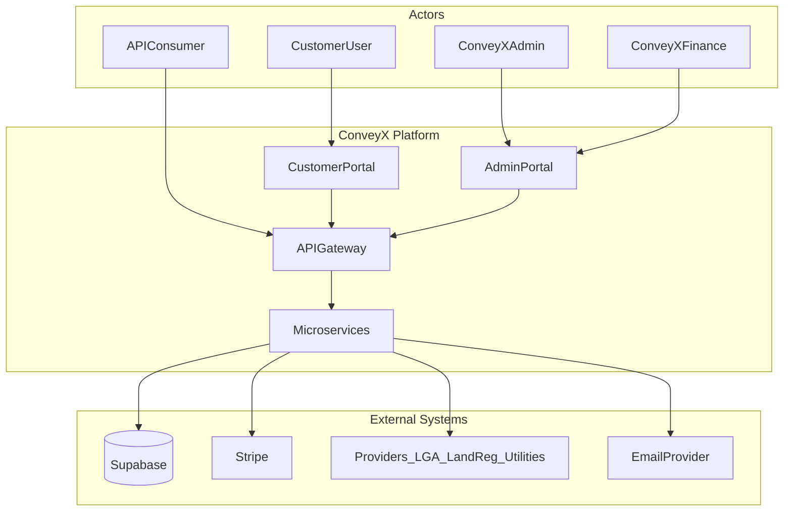
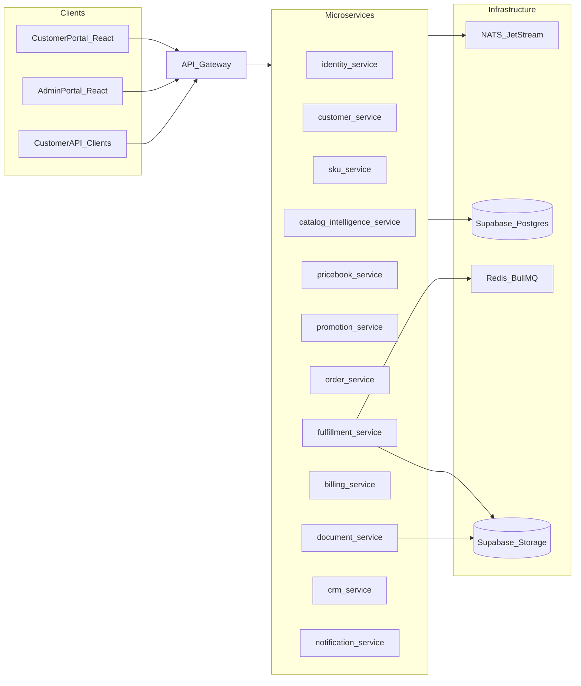
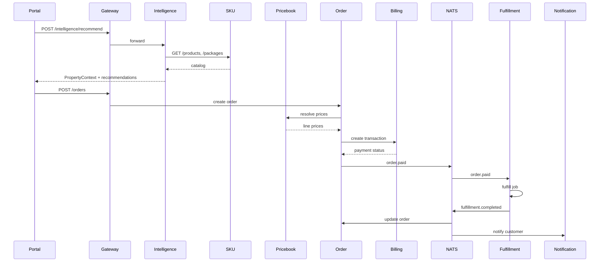
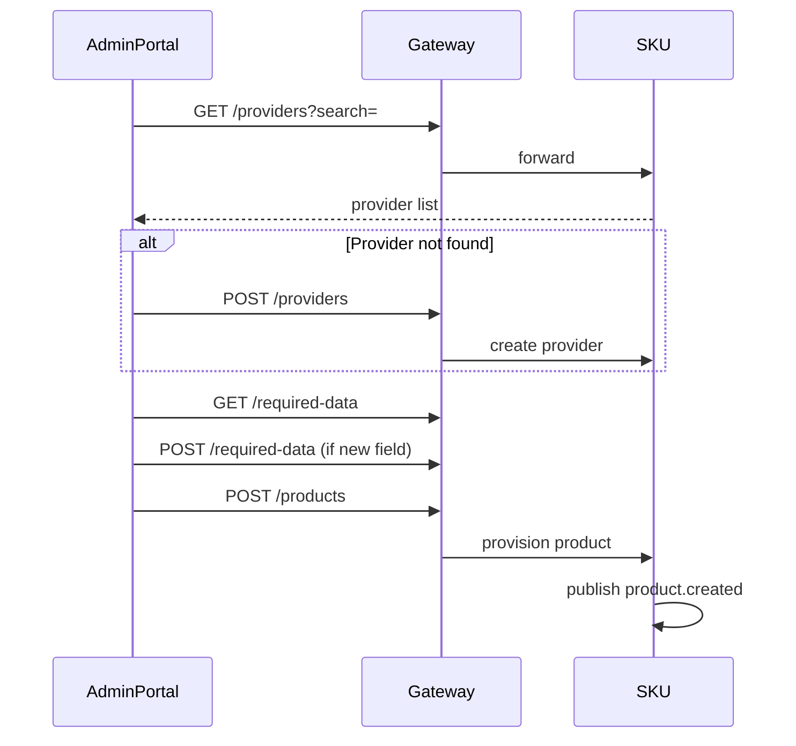
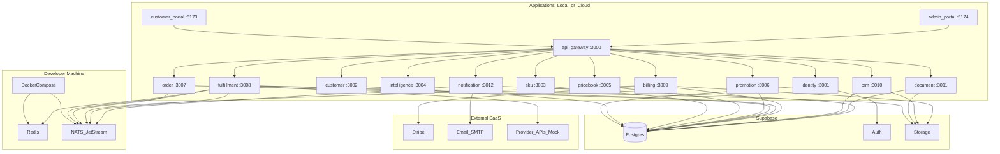
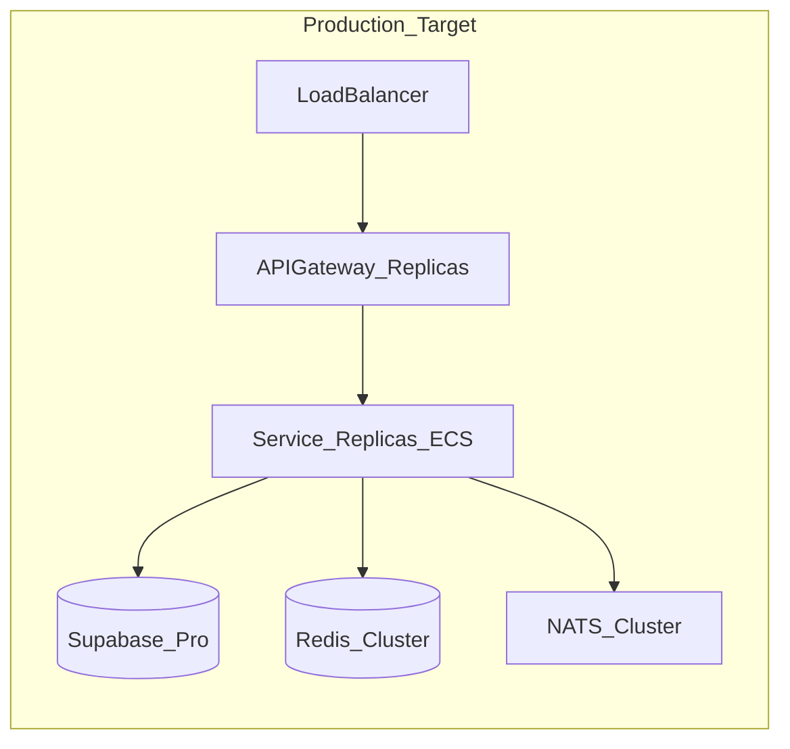

# ConveyX Architecture

This document describes the system architecture for ConveyX — an API-first, microservices conveyancing due diligence platform for Australia. It covers service boundaries, inter-service communication, the domain event catalog, and the POC deployment topology.

**Related docs:** [PRD](./PRD.md) · [API outline](./API.md)

---

## 1. Architecture Principles

| Principle | Description |
|-----------|-------------|
| **API-first** | Every module exposes a versioned REST API (`/v1/`). Portals and external clients never access service databases directly. |
| **Bounded contexts** | Each microservice owns one business domain and its Postgres schema. |
| **Schema-per-service** | One Supabase Postgres project; logical isolation via schemas (`sku`, `order`, `billing`, etc.). |
| **Events for side effects** | Order placement, fulfillment, and billing use async domain events (CloudEvents on NATS). |
| **Sync for reads/queries** | Catalog browse, price resolution, and recommendations use synchronous HTTP between services. |
| **Adapter pattern** | External providers (land registries, LGAs, utilities) integrate via pluggable adapters in the fulfillment service. |
| **Multi-tenancy** | All customer data scoped by `entity_id` (master or branch account). JWT carries `entity_id`, `user_id`, and `roles`. |

---

## 2. System Context



---

## 3. High-Level Component Diagram



---

## 4. Service Boundaries

Each service is a independently deployable Node.js + TypeScript process. Services communicate via HTTP (sync) and NATS (async). No cross-schema SQL joins at runtime.

### 4.1 API Gateway (`apps/api-gateway`)

| Owns | Does not own |
|------|--------------|
| Routing, rate limiting, JWT validation, OpenAPI aggregation | Business logic, database access |

**Routes traffic to:** all backend services under `/v1/{domain}/...`

**Auth:** Validates Supabase-issued JWT; forwards `Authorization`, `X-Entity-Id`, `X-Request-Id` headers.

---

### 4.2 Identity Service (`services/identity`)

| Schema | `identity` |
|--------|------------|
| **Owns** | User profiles, team memberships, RBAC role assignments, session metadata |
| **Does not own** | Entity (customer account) business data — that lives in `customer-service` |

**Supabase Auth integration:** Wraps Supabase Auth for sign-up/sign-in. On login, enriches JWT custom claims with `entity_id`, `entity_type` (master \| branch), `roles[]`, `team_ids[]`.

**Key tables:** `users`, `team_memberships`, `role_assignments`

**Publishes:** `user.created`, `user.updated`, `team.membership_changed`

**Consumes:** `entity.created` (from customer-service) to link new entities

---

### 4.3 Customer Service (`services/customer`)

| Schema | `customer` |
|--------|------------|
| **Owns** | Master/branch entities, entity hierarchy, billing preference, Stripe customer ID reference |
| **Does not own** | User auth, CRM notes/contracts, price books |

**Key tables:** `entities`, `entity_settings`, `entity_hierarchy`

**Account rules enforced here:**
- User belongs to exactly one master or branch entity
- Reseller model: branch entities reference parent master entity

**Publishes:** `entity.created`, `entity.updated`, `entity.billing_preference_changed`

---

### 4.4 SKU Service (`services/sku`)

| Schema | `sku` |
|--------|--------|
| **Owns** | Products, providers, required data field library, packages, councils reference data |
| **Does not own** | Customer-specific pricing, orders, fulfillment |

**Key tables:** `products`, `providers`, `required_data`, `packages`, `package_items`, `councils`

**Product provisioning:** Admin creates products with state, type, council, provider, GST rules, fulfillment method, and buyer/seller required data field ID arrays.

**Publishes:** `product.created`, `product.updated`, `product.deprecated`, `package.created`, `package.updated`, `provider.created`

**Consumed by (sync HTTP):** catalog-intelligence, order, pricebook, fulfillment, admin portal

---

### 4.5 Catalog Intelligence Service (`services/catalog-intelligence`)

| Schema | `catalog_intelligence` (optional — cache/rules only) |
|--------|------------------------------------------------------|
| **Owns** | Property resolution rules, recommendation ranking config, resolution cache |
| **Does not own** | Product catalog data — reads from SKU service |

**Inputs:** Property identifier — `title_reference`, `vol_fol`, `lot_plan`, or `address`

**Outputs:** `PropertyContext` (state, council, confidence) + ranked list of products and packages

**Sync calls:**
- `GET sku-service /v1/products` — filter by state, council, type, display_on_ui
- `GET sku-service /v1/packages` — filter by scope

**POC:** Rule-based parsers; production adds geocoding/title lookup APIs.

---

### 4.6 Price Book Service (`services/pricebook`)

| Schema | `pricebook` |
|--------|-------------|
| **Owns** | Per-entity price books, price book entries, effective date ranges |
| **Does not own** | Base retail prices (SKU service), promotions, CRM contracts |

**Price resolution chain (orchestrated here):**
1. Product `retail_price` (HTTP → SKU service)
2. CRM contract fixed price (HTTP → CRM service, if active)
3. Price book override (% or $)
4. Best eligible promotion (HTTP → Promotion service)
5. GST per product `gst_option`

**Key tables:** `price_books`, `price_book_entries`

**Publishes:** `pricebook.created`, `pricebook.entry_updated`

---

### 4.7 Promotion Service (`services/promotion`)

| Schema | `promotion` |
|--------|-------------|
| **Owns** | Promotions, promotion-SKU links, promotion-customer/group targets, schedules |
| **Does not own** | Price books, orders |

**Key tables:** `promotions`, `promotion_products`, `promotion_targets`

**Publishes:** `promotion.activated`, `promotion.expired`

---

### 4.8 Order Service (`services/order`)

| Schema | `order` |
|--------|----------|
| **Owns** | Orders, order lines, property identifiers, captured required_data JSON, order state machine |
| **Does not own** | Billing transactions, fulfillment jobs, product definitions |

**Order states:** `draft` → `submitted` → `pending_payment` → `paid` → `fulfilling` → `completed` | `failed` | `cancelled`

**Sync calls on submit:**
- Catalog intelligence (recommendations — optional re-validate)
- Price book (resolve line prices)
- Billing (create transaction)

**Publishes:** `order.created`, `order.submitted`, `order.paid`, `order.completed`, `order.cancelled`

**Consumes:** `payment.received`, `fulfillment.completed`, `fulfillment.failed`

---

### 4.9 Fulfillment Service (`services/fulfillment`)

| Schema | `fulfillment` |
|--------|---------------|
| **Owns** | Fulfillment jobs, attempts, manual task queue, provider adapter registry |
| **Does not own** | Order records, product definitions, billing |

**Job queue:** BullMQ + Redis

**Artifact storage:** Supabase Storage bucket `fulfillment-docs`

**Routing by product `fulfillment_method`:**
| Method | Behavior |
|--------|----------|
| `API` | Provider adapter HTTP call with order metadata |
| `Automation` | Script/RPA worker (POC: simulated delay + mock PDF) |
| `Manual` | Creates ops task; ConveyX ops uploads result via admin portal |

**Consumes:** `order.paid`

**Publishes:** `fulfillment.started`, `fulfillment.completed`, `fulfillment.failed`

**Sync calls:** SKU service (product + provider details), order service (read line metadata)

---

### 4.10 Billing Service (`services/billing`)

| Schema | `billing` |
|--------|-----------|
| **Owns** | Transactions, invoices, invoice lines, payments, billing cycles |
| **Does not own** | Order content, entity settings (reads billing preference from customer service) |

**Payment modes:**
- **Invoice** — accumulate transactions; billing cycle job generates invoice PDF
- **Credit card** — Stripe PaymentIntent on order submit

**External:** Stripe webhooks (`payment_intent.succeeded`, `invoice.paid`)

**Publishes:** `transaction.created`, `payment.received`, `invoice.generated`, `payment.failed`

**Consumes:** `order.submitted` (create transaction)

---

### 4.11 CRM Service (`services/crm`)

| Schema | `crm` |
|--------|-------|
| **Owns** | Customer profiles, ARR contracts, customer groups, contract SKU pricing |
| **Does not own** | Entity records, billing transactions |

**Key tables:** `customer_profiles`, `contracts`, `contract_products`, `customer_groups`, `group_memberships`

**Publishes:** `contract.created`, `contract.activated`, `contract.expired`

**Storage:** Generated contract PDFs → Supabase Storage bucket `contracts`

---

### 4.12 Document Service (`services/document`)

| Schema | `document` |
|--------|------------|
| **Owns** | Document sign envelopes, sign status, document-order links |
| **Does not own** | Order state, fulfillment artifacts |

**POC:** Stub signing workflow; stores signed PDFs in Supabase Storage bucket `signed-docs`

**Publishes:** `document.sign_requested`, `document.sign_completed`

---

### 4.13 Notification Service (`services/notification`)

| Schema | `notification` |
|--------|----------------|
| **Owns** | Notification templates, delivery log, customer webhook registrations |
| **Does not own** | Domain state in other services |

**Channels:** Email (transactional), customer webhooks (order/fulfillment events)

**Consumes:** `order.completed`, `fulfillment.completed`, `fulfillment.failed`, `invoice.generated`, `payment.received`

**Publishes:** `notification.sent`, `notification.failed`

---

## 5. Service Interaction Matrix

| From → To | identity | customer | sku | intelligence | pricebook | promotion | order | fulfillment | billing | crm | document | notification |
|-----------|:--------:|:--------:|:---:|:------------:|:---------:|:---------:|:-----:|:-----------:|:-------:|:---:|:--------:|:------------:|
| **Gateway** | ✓ | ✓ | ✓ | ✓ | ✓ | ✓ | ✓ | ✓ | ✓ | ✓ | ✓ | ✓ |
| **Order** | | ✓ | ✓ | ✓ | ✓ | | | | ✓ | ✓ | | |
| **Pricebook** | | | ✓ | | | ✓ | | | | ✓ | | |
| **Intelligence** | | | ✓ | | | | | | | | | |
| **Fulfillment** | | | ✓ | | | | ✓ | | | | | |
| **Billing** | | ✓ | | | | | ✓ | | | | | |
| **Notification** | | ✓ | | | | | ✓ | ✓ | ✓ | | ✓ | |

✓ = synchronous HTTP allowed. Async events via NATS are preferred for state changes that don't need an immediate response.

---

## 6. Domain Event Catalog

All events use [CloudEvents 1.0](https://cloudevents.io/) format published to NATS JetStream subjects `conveyx.{domain}.{event}`.

### 6.1 Event Envelope

```json
{
  "specversion": "1.0",
  "id": "uuid",
  "source": "conveyx/order-service",
  "type": "conveyx.order.paid",
  "time": "2026-08-29T10:00:00Z",
  "datacontenttype": "application/json",
  "data": { }
}
```

### 6.2 Events by Domain

#### Identity (`conveyx.identity.*`)

| Event | Trigger | Key payload fields | Consumers |
|-------|---------|-------------------|-----------|
| `user.created` | New user registered | `user_id`, `entity_id`, `email` | notification |
| `user.updated` | Profile changed | `user_id`, `changes` | — |
| `team.membership_changed` | User added/removed from team | `user_id`, `team_id`, `action` | — |

#### Customer (`conveyx.customer.*`)

| Event | Trigger | Key payload fields | Consumers |
|-------|---------|-------------------|-----------|
| `entity.created` | New master/branch account | `entity_id`, `entity_type`, `parent_id` | identity, crm |
| `entity.updated` | Entity settings changed | `entity_id`, `changes` | — |
| `entity.billing_preference_changed` | Invoice ↔ card switch | `entity_id`, `preference` | billing |

#### SKU (`conveyx.sku.*`)

| Event | Trigger | Key payload fields | Consumers |
|-------|---------|-------------------|-----------|
| `product.created` | Product provisioned | `product_id`, `sku`, `state`, `type` | — |
| `product.updated` | Product edited | `product_id`, `changes` | — |
| `product.deprecated` | Product deactivated | `product_id`, `sku` | — |
| `package.created` | Package created | `package_id`, `scope_type` | — |
| `provider.created` | New provider added | `provider_id`, `provider_name` | — |

#### Order (`conveyx.order.*`)

| Event | Trigger | Key payload fields | Consumers |
|-------|---------|-------------------|-----------|
| `order.created` | Draft order saved | `order_id`, `entity_id`, `user_id` | — |
| `order.submitted` | Customer submitted order | `order_id`, `entity_id`, `lines[]`, `total_inc_gst` | billing |
| `order.paid` | Payment confirmed or invoice approved | `order_id`, `entity_id`, `lines[]` | fulfillment |
| `order.completed` | All lines fulfilled | `order_id`, `entity_id` | notification |
| `order.cancelled` | Order cancelled | `order_id`, `reason` | billing, notification |

#### Fulfillment (`conveyx.fulfillment.*`)

| Event | Trigger | Key payload fields | Consumers |
|-------|---------|-------------------|-----------|
| `fulfillment.started` | Job picked up | `job_id`, `order_id`, `order_line_id`, `method` | — |
| `fulfillment.completed` | Result delivered | `job_id`, `order_id`, `order_line_id`, `document_url` | order, notification |
| `fulfillment.failed` | Job failed after retries | `job_id`, `order_id`, `order_line_id`, `error` | order, notification |

#### Billing (`conveyx.billing.*`)

| Event | Trigger | Key payload fields | Consumers |
|-------|---------|-------------------|-----------|
| `transaction.created` | Transaction recorded | `transaction_id`, `order_id`, `amount_inc_gst` | — |
| `payment.received` | Stripe payment succeeded | `transaction_id`, `order_id`, `stripe_payment_id` | order |
| `payment.failed` | Payment failed | `transaction_id`, `order_id`, `error` | order, notification |
| `invoice.generated` | Billing cycle invoice created | `invoice_id`, `entity_id`, `pdf_url` | notification |

#### Promotion (`conveyx.promotion.*`)

| Event | Trigger | Key payload fields | Consumers |
|-------|---------|-------------------|-----------|
| `promotion.activated` | Promotion start time reached | `promotion_id`, `product_ids[]` | — |
| `promotion.expired` | Promotion end time reached | `promotion_id` | — |

#### CRM (`conveyx.crm.*`)

| Event | Trigger | Key payload fields | Consumers |
|-------|---------|-------------------|-----------|
| `contract.created` | New ARR contract | `contract_id`, `entity_id` | — |
| `contract.activated` | Contract effective | `contract_id`, `entity_id`, `product_prices[]` | pricebook |
| `contract.expired` | Contract ended | `contract_id`, `entity_id` | pricebook |

#### Document (`conveyx.document.*`)

| Event | Trigger | Key payload fields | Consumers |
|-------|---------|-------------------|-----------|
| `document.sign_requested` | Sign workflow initiated | `document_id`, `order_id` | notification |
| `document.sign_completed` | All parties signed | `document_id`, `order_id`, `signed_url` | order, notification |

---

## 7. Critical Flows

### 7.1 Search-First Order (Sync + Async)



### 7.2 Product Provisioning (Admin)



---

## 8. Data Layer — Supabase

### 8.1 Schema Ownership

| Schema | Service | Primary tables |
|--------|---------|----------------|
| `identity` | identity | users, team_memberships, role_assignments |
| `customer` | customer | entities, entity_settings, entity_hierarchy |
| `sku` | sku | products, providers, required_data, packages, package_items, councils |
| `catalog_intelligence` | catalog-intelligence | resolution_cache, ranking_rules |
| `pricebook` | pricebook | price_books, price_book_entries |
| `promotion` | promotion | promotions, promotion_products, promotion_targets |
| `order` | order | orders, order_lines, property_identifiers |
| `fulfillment` | fulfillment | fulfillment_jobs, fulfillment_attempts, manual_tasks |
| `billing` | billing | transactions, invoices, invoice_lines, payments, billing_cycles |
| `crm` | crm | customer_profiles, contracts, contract_products, customer_groups |
| `document` | document | documents, sign_envelopes |
| `notification` | notification | notification_log, webhook_registrations |

### 8.2 Storage Buckets

| Bucket | Written by | Contents |
|--------|-----------|----------|
| `fulfillment-docs` | fulfillment-service | Search results, certificates, PDFs |
| `contracts` | crm-service | Generated ARR contract PDFs |
| `signed-docs` | document-service | Digitally signed documents |
| `invoices` | billing-service | Generated invoice PDFs |

### 8.3 Auth

- **Supabase Auth** handles sign-up, sign-in, password reset
- **identity-service** sets JWT custom claims: `entity_id`, `entity_type`, `roles`, `team_ids`
- **API gateway** validates JWT on every request; services trust gateway-forwarded identity headers within the private network

---

## 9. POC Deployment Diagram



### 9.1 POC Runtime Topology

| Component | POC hosting | Notes |
|-----------|-------------|-------|
| Supabase Postgres + Auth + Storage | Supabase cloud project (or `supabase start` locally) | Single project; schema-per-service migrations |
| Redis | Docker Compose locally (or Upstash for shared demo) | BullMQ fulfillment queue |
| NATS JetStream | Docker Compose locally | Domain events |
| Microservices (12) | Local Node processes via Turborepo `dev` | One port per service |
| React portals | Vite dev servers | Proxy API calls to gateway |
| API Gateway | Local :3000 | Single entry point |
| Stripe | Test mode | Webhooks via Stripe CLI tunnel |

### 9.2 Environment Variables (per service)

```
SUPABASE_URL=
SUPABASE_SERVICE_ROLE_KEY=
SUPABASE_SCHEMA=sku          # schema name for this service
NATS_URL=nats://localhost:4222
REDIS_URL=redis://localhost:6379
STRIPE_SECRET_KEY=           # billing-service only
STRIPE_WEBHOOK_SECRET=       # billing-service only
```

### 9.3 Production Target (post-POC)



- Containerize each service (Docker)
- Deploy to AWS ECS/Fargate or similar
- Supabase Pro for managed Postgres + Auth + Storage
- Managed Redis (ElastiCache or Upstash)
- NATS cluster or migrate to AWS SQS/SNS for events at scale

---

## 10. Security Boundaries

| Layer | Control |
|-------|---------|
| **Gateway** | JWT validation, rate limiting, CORS, request ID |
| **Service** | Entity-scoped queries (`WHERE entity_id = $jwt.entity_id`) |
| **Supabase RLS** | Optional row-level policies on portal-readable tables |
| **Storage** | Signed URLs with expiry for document downloads |
| **Secrets** | Provider credentials, Stripe keys in env/secrets manager — never in Postgres plaintext (POC: env vars; prod: AWS Secrets Manager) |
| **Audit** | All admin mutations logged to `identity.audit_log` |

---

## 11. Repository Layout

```
conveyX/
├── apps/
│   ├── api-gateway/
│   ├── customer-portal/
│   └── admin-portal/
├── services/
│   ├── identity/
│   ├── customer/
│   ├── sku/
│   ├── catalog-intelligence/
│   ├── pricebook/
│   ├── promotion/
│   ├── order/
│   ├── fulfillment/
│   ├── billing/
│   ├── crm/
│   ├── document/
│   └── notification/
├── packages/
│   ├── shared-types/       # DTOs, enums shared across services
│   ├── events/             # CloudEvents type definitions
│   └── ui/                 # Shared React components
├── supabase/
│   ├── config.toml
│   ├── migrations/
│   └── seed.sql
├── infra/
│   └── docker-compose.yml  # Redis + NATS
└── docs/
    ├── PRD.md
    ├── ARCHITECTURE.md     # this file
    └── API.md
```

---

## 12. Observability (POC baseline)

| Signal | Tool | Notes |
|--------|------|-------|
| Logs | Structured JSON to stdout | Include `request_id`, `entity_id`, `service` |
| Traces | OpenTelemetry → Jaeger (optional POC) | Propagate `traceparent` from gateway |
| Metrics | Prometheus-compatible `/metrics` endpoint | Order count, fulfillment latency, queue depth |
| Health | `GET /health` per service | Liveness + Postgres connectivity check |

---

## 13. Decision Log

| Decision | Choice | Rationale |
|----------|--------|-----------|
| Database | Supabase Postgres | Managed, fast POC setup, Auth + Storage included |
| Schema isolation | Schema-per-service in one DB | Balance microservice boundaries with POC simplicity |
| Event bus | NATS JetStream | Lightweight, CloudEvents-friendly, runs in Docker |
| Job queue | BullMQ + Redis | Reliable fulfillment retries and manual task scheduling |
| Auth | Supabase Auth + custom claims | Avoid Keycloak ops overhead in POC |
| Cross-service reads | HTTP only | Prevents tight coupling via shared SQL |
| Provider integration | Adapter pattern in fulfillment | Swap mock → real without changing order flow |
