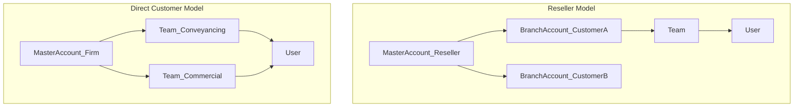
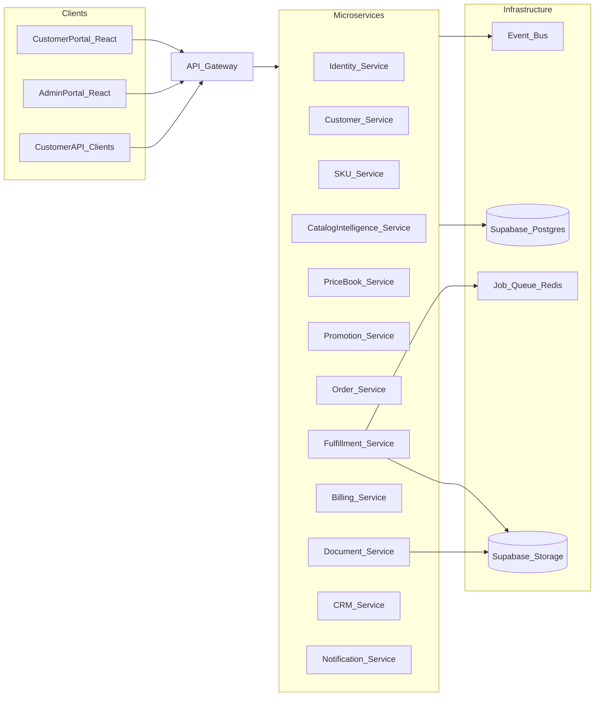
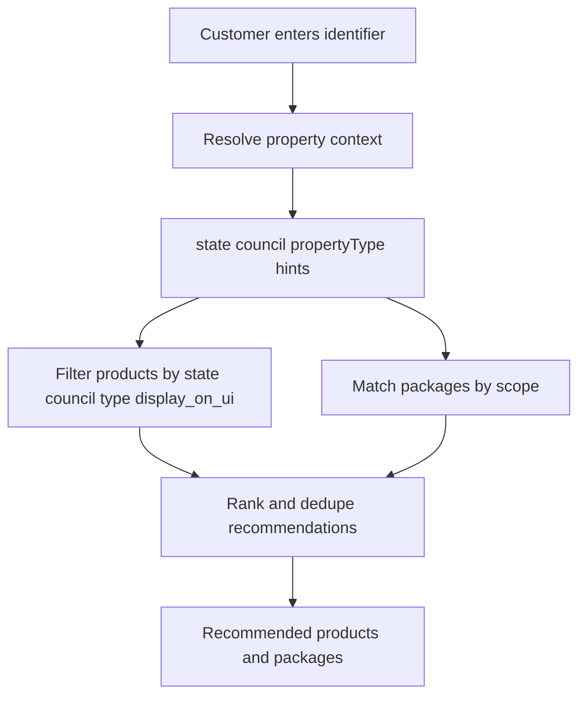
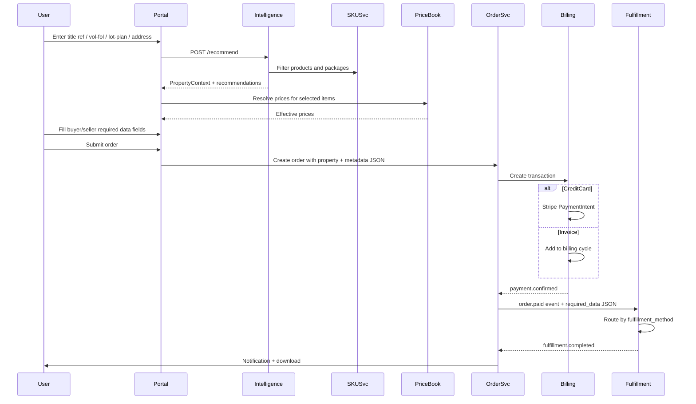
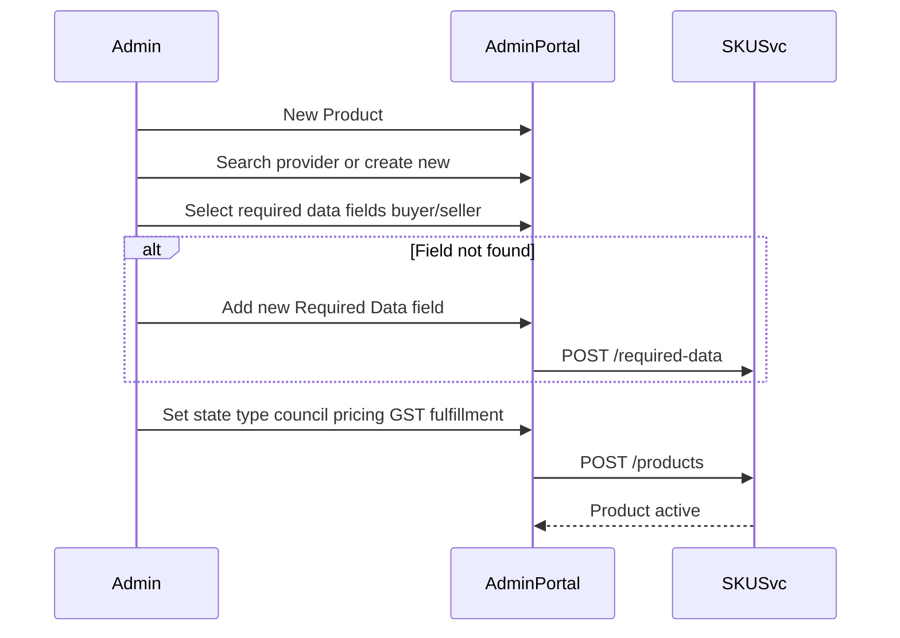
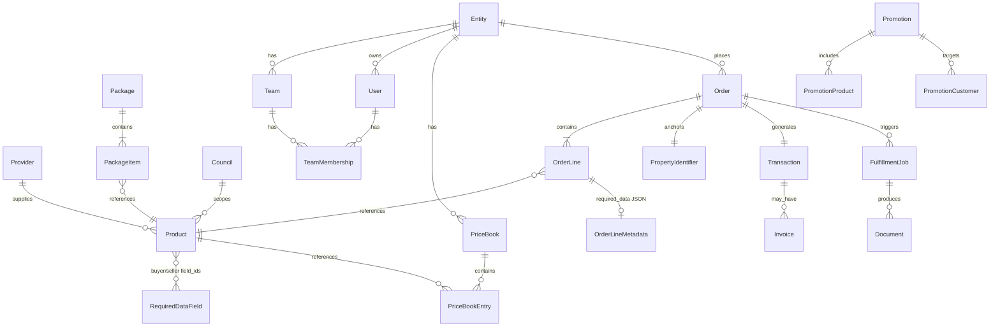
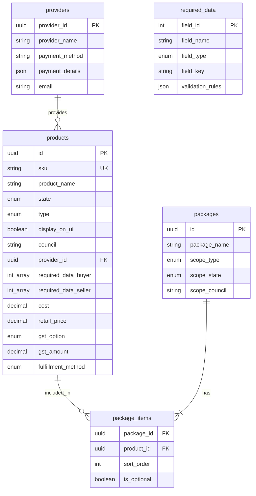

# ConveyX — Product Requirements Document (PRD)

**Version:** 1.0 (POC)  
**Status:** Draft  
**Related docs:** [Architecture](./ARCHITECTURE.md) · [API outline](./API.md)

---


## 1. Executive Summary

**ConveyX** is a B2B platform for Australian conveyancing due diligence. It provides a **Customer Portal** for ordering searches/certificates and a **Developer API** for programmatic ordering. The platform is built as **API-first microservices**, with each business domain owning its data and exposing REST (and optionally webhook) APIs.

**POC goal:** Prove end-to-end order flow — catalog browse → price resolution → order placement → fulfillment (mock + one real provider path) → delivery → billing (Stripe invoice + card) — across a **multi-state SKU catalog** with mocked provider responses for most integrations. **Data layer: Supabase** (Postgres schemas + Storage + Auth).

---

## 2. Problem Statement

Conveyancing firms, legal practices, and resellers need a single platform to order property title searches, government/utility certificates, VOI/AML checks, and digital document signing across all Australian states. Today this is fragmented across multiple provider portals with inconsistent pricing, manual fulfillment, and poor audit trails.

**ConveyX solves:** Unified catalog, customer-specific pricing, automated fulfillment, centralized billing, and a consistent API.

---

## 3. Goals and Non-Goals

### Goals
- API-first architecture; every module communicates via HTTP APIs and async events
- Multi-tenant account hierarchy (Master → Branch → Team → User)
- Per-customer price books, promotions, and contract pricing
- Auto-fulfillment engine with queue-based processing (API / Automation / Manual methods)
- Billing via invoice cycles or Stripe credit card — **no subscriptions**
- Admin portal for SKU, price book, customer, and promotion management
- Customer portal for ordering and order/document management
- Multi-state land registry and certificate catalog (all AU states in catalog; phased real integrations)

### Non-Goals (POC)
- Full production integrations with every state land registry and every LGA
- Advanced AML/VOI compliance certification (stub + integration hooks only)
- Native mobile apps
- Subscription billing

---

## 4. Users and Personas

| Persona | Description | Primary Modules |
|---------|-------------|-----------------|
| **ConveyX Admin** | Internal ops — manages SKUs, providers, fulfillment rules | SKU Manager, Fulfillment Engine, CRM |
| **ConveyX Finance** | Invoicing, Stripe reconciliation, ARR contracts | Billing, CRM |
| **Customer Admin** | Firm/practice owner — users, teams, billing prefs | Customer Manager, Customer Portal |
| **Customer User** | Conveyancer — places orders, downloads results | Customer Portal |
| **Reseller Admin** | Master account managing branch customers | Customer Manager, Price Book |
| **Branch Admin** | Manages teams/users under a branch entity | Customer Manager |
| **API Consumer** | Integration developer at customer firm | Public API + webhooks |

---

## 5. Terminology (Glossary)

| Term | Definition |
|------|------------|
| **Product / SKU** | Orderable product with code, pricing, GST rules, provider, fulfillment method, and required data fields |
| **Package** | Admin-defined bundle of Products; scoped globally, by state, or by council |
| **Required Data Field** | Reusable form field definition (field_id, name, type) attached to Products for buyer/seller capture |
| **Property Identifier** | Customer-supplied search anchor: title reference, vol/fol, lot/plan, or address |
| **Catalog Intelligence** | Service that resolves property context and recommends SKUs/packages |
| **Fulfillment** | Delivery of order content (document/data) to customer |
| **Customer (Account)** | Master entity — firm, company, or reseller |
| **Branch Account** | Sub-entity under a master (reseller's end customer) |
| **Team** | User grouping within one master or branch |
| **User** | Login identity; belongs to exactly one master OR branch; can join multiple teams within that entity |
| **Price Book** | Per-customer SKU pricing overrides (% or $ discount off base price) |
| **Provider** | External data source — LGA, state gov, utility, body corporate, 3rd party |
| **Certificate** | Property certificate SKU (rates, water, strata, etc.) |
| **Land Register SKU** | State land title/plan/dealing API product |
| **Fulfillment Method** | `API` \| `Automation` \| `Manual` |

---

## 6. Account Structure and Access Control



### Rules
- One **User** belongs to **exactly one** Master or Branch account (never both, never multiple masters/branches)
- One **User** may enroll in **multiple Teams** under the same Master or Branch
- **Reseller**: Master = reseller; their customers use Branch accounts
- **Direct customer**: Master = firm; Teams group users; no branch unless reseller model applies

### RBAC Roles (per entity scope)
- `entity_admin` — manage users, teams, billing settings
- `entity_billing` — view invoices, payment methods
- `entity_user` — place orders, view own team orders
- `conveyx_admin` — platform-wide admin
- `conveyx_ops` — fulfillment manual queue

---

## 7. Product Modules (Microservices)



### 7.1 SKU Manager (`sku-service`)
**Purpose:** Canonical catalog — Products, Providers, Required Data field library, Packages, and council reference data.

**Admin capabilities:**
- **Provision (create/edit/activate/deprecate) Products**
- Manage **Provider** registry (search-or-create on product form)
- Manage **Required Data** field library; attach fields to products
- Group products into **Packages** with global, state, or council scope
- Toggle product visibility via `display_on_ui`

---

#### 7.1.1 Data Model — Product Table (`products`)

| Column | Type | Constraints | Notes |
|--------|------|-------------|-------|
| `id` | UUID | PK | Internal ID |
| `product_name` | string | required | Display name |
| `sku` | string | unique, required | Product code |
| `state` | enum | required | `QLD` \| `VIC` \| `NSW` \| `SA` \| `WA` \| `NT` \| `ACT` \| `TAS` |
| `type` | enum | required | `LGA` \| `BodyCorp` \| `LandInfo` \| `State_government` \| `Utility` \| `Other` |
| `display_on_ui` | boolean | default true | Hide from customer catalog when false |
| `description` | text | optional | |
| `council` | string | required | `ALL` or specific council code from state council list |
| `provider_id` | UUID | FK → providers | Searchable dropdown; inline create if not found |
| `required_data_buyer` | int[] | optional | Array of `required_data.field_id` values, e.g. `[1,3,4]` |
| `required_data_seller` | int[] | optional | Same pattern for seller-side fields |
| `cost` | decimal(10,2) | required | Provider cost (ex GST) |
| `retail_price` | decimal(10,2) | required | Default customer price (ex GST); price book overrides at order time |
| `gst_option` | enum | required | `no_gst` \| `normal_gst_10` \| `fixed_gst_percent` \| `fixed_gst_amount` |
| `gst_amount` | decimal(10,2) | conditional | Required when `gst_option` is `fixed_gst_percent` or `fixed_gst_amount` |
| `fulfillment_method` | enum | required | `API` \| `Automation` \| `Manual` |
| `status` | enum | default draft | `draft` \| `active` \| `deprecated` |
| `created_at` / `updated_at` | timestamp | | Audit |

**GST calculation rules:**
- `no_gst` → GST = 0
- `normal_gst_10` → GST = retail_price × 10%
- `fixed_gst_percent` → GST = retail_price × gst_amount% (gst_amount stores percentage)
- `fixed_gst_amount` → GST = fixed dollar value in gst_amount

**Council reference:** Separate `councils` table seeded per state; product form filters councils by selected state. Value `ALL` means product applies to any council in that state.

---

#### 7.1.2 Data Model — Provider Table (`providers`)

| Column | Type | Constraints | Notes |
|--------|------|-------------|-------|
| `provider_id` | UUID | PK | |
| `provider_name` | string | unique, required | |
| `payment_method` | string | optional | e.g. invoice, direct debit, portal prepay |
| `payment_details` | text/JSON | optional | Encrypted at rest in production |
| `description` | text | optional | |
| `address` | text | optional | |
| `email` | string | optional | |
| `contact_number` | string | optional | |

**UI behavior:** Product form has typeahead search on `provider_name`. If no match, modal opens to create provider inline; new `provider_id` returned and bound to product.

---

#### 7.1.3 Data Model — Required Data Field Library (`required_data`)

Reusable field definitions. Admin selects multiple fields when creating a product; product stores selected `field_id` arrays for buyer and seller sides.

| Column | Type | Constraints | Notes |
|--------|------|-------------|-------|
| `field_id` | serial/int | PK | e.g. 1, 2, 3 — referenced in product arrays |
| `field_name` | string | required | Label shown to customer |
| `field_type` | enum | required | `text` \| `number` \| `binary` \| `date` \| `select` \| `boolean` |
| `field_key` | string | unique | Machine key for API/fulfillment JSON, e.g. `buyer_full_name` |
| `validation_rules` | JSONB | optional | min/max, regex, allowed values for `select` |
| `metadata` | JSONB | optional | Help text, placeholder, file constraints for `binary` |
| `created_at` / `updated_at` | timestamp | | |

**Workflow:**
1. Admin creates product → selects existing required data fields for buyer and/or seller
2. Product persists `required_data_buyer: [1,3,4]` and `required_data_seller: [2,5]`
3. If needed field missing → admin adds to `required_data` table → immediately selectable
4. At order time, order service hydrates field definitions by ID and renders dynamic form; captured values stored as JSON metadata per order line

**Example captured metadata on order line:**
```json
{
  "buyer": { "1": "John Smith", "3": "12345678901" },
  "seller": { "2": "Jane Doe" },
  "property": { "lot_plan": "1/SP123456", "address": "1 George St, Sydney NSW 2000" }
}
```

---

#### 7.1.4 Data Model — Package Tables

Admin groups products into packages for faster ordering. Packages can be scoped for different use cases.

**`packages`**

| Column | Type | Notes |
|--------|------|-------|
| `id` | UUID | PK |
| `package_name` | string | e.g. "NSW Standard Purchase Package" |
| `description` | text | |
| `scope_type` | enum | `global` \| `state` \| `council` |
| `scope_state` | enum | Required if scope = state or council |
| `scope_council` | string | Required if scope = council; `ALL` or specific |
| `display_on_ui` | boolean | |
| `status` | enum | `draft` \| `active` \| `deprecated` |

**`package_items`**

| Column | Type | Notes |
|--------|------|-------|
| `package_id` | UUID | FK |
| `product_id` | UUID | FK → products |
| `sort_order` | int | Display sequence |
| `is_optional` | boolean | Default false — customer can deselect optional items |

**Package scope rules:**
- `global` — available everywhere; used for cross-state products (VOI, AML, doc sign)
- `state` — only shown when customer's property resolves to that state
- `council` — only shown when property resolves to that council (or `ALL` councils in state)

**Events:** `product.created|updated|deprecated`, `package.created|updated`, `provider.created`

**Key entities:** `Product`, `Provider`, `RequiredDataField`, `Council`, `Package`, `PackageItem`

---

### 7.1.5 Catalog Intelligence Service (`catalog-intelligence-service`)
**Purpose:** Resolve property context from customer input and recommend products/packages.

**Why separate service:** Keeps SKU service as pure catalog CRUD; intelligence can evolve (rules engine → ML) without touching product data.

**Customer property identifiers (at least one required to start a search):**

| Identifier | Example | Typical use |
|------------|---------|-------------|
| `title_reference` | NSW title ref | LandInfo SKUs |
| `vol_fol` | Vol 123 Fol 456 | Legacy title lookup |
| `lot_plan` | Lot 1 DP 123456 | Plan-based searches |
| `address` | 1 George St, Sydney NSW 2000 | LGA, utility, body corp |

**Intelligence flow:**


**Resolution steps (POC — rule-based; production — external geocoding/title APIs):**
1. **Address** → geocode API → derive state + LGA/council + coordinates
2. **Lot/plan** → parse plan prefix → map to state registry rules → infer state
3. **Title reference / vol-fol** → state-specific parser → infer state (+ council where possible)
4. Return `PropertyContext`: `{ state, council, identifier_type, normalized_identifier, confidence }`

**Recommendation rules:**
- Include all `display_on_ui = true` products where `product.state = context.state` AND (`product.council = ALL` OR `product.council = context.council`)
- Include packages where scope matches: global always; state if match; council if match
- Boost ranking: LandInfo first for title/vol-fol/lot-plan inputs; LGA + Utility for address; BodyCorp if strata signals detected (POC: manual flag or keyword in address)
- De-duplicate products already in a recommended package; show package as primary, individual SKUs as add-ons

**API:**
- `POST /v1/intelligence/resolve` — input identifier → PropertyContext
- `POST /v1/intelligence/recommend` — input identifier → `{ context, products[], packages[] }`

---

### 7.2 Auto Fulfillment Engine (`fulfillment-service`)
**Purpose:** Process orders and deliver results.

**Responsibilities:**
- Consume `order.paid` / `order.approved` events
- Read order line metadata: property identifier + buyer/seller required_data JSON
- Route by product `fulfillment_method`:
  - **API** — call provider adapter synchronously/async
  - **Automation** — RPA/script worker (POC: simulated)
  - **Manual** — ops queue with assignment and SLA tracking
- Retry with exponential backoff; dead-letter queue
- Store fulfillment artifacts in object storage; emit `fulfillment.completed|failed`
- Provider adapter pattern — one adapter per provider integration

**Key entities:** `FulfillmentJob`, `FulfillmentAttempt`, `ManualTask`

---

### 7.3 Price Book Manager (`pricebook-service`)
**Purpose:** Customer-specific pricing.

**Responsibilities:**
- Base price comes from Product `retail_price` in SKU service
- Per-customer overrides: `% discount` OR `$ fixed price` (support both; default POC: **% discount with optional fixed override per SKU**)
- Price resolution API: `GET /pricebooks/{customerId}/resolve?skuIds=...` → effective price incl. GST
- Effective date ranges; version history
- Integrates with Promotion service (promotion applied after price book, before order total)

**Key entities:** `PriceBook`, `PriceBookEntry`, `PriceResolution`

---

### 7.4 Customer Manager (`customer-service` + `identity-service`)
Split for bounded contexts:

**`identity-service`:** Users, auth (JWT/OAuth2), teams, sessions, password reset, MFA (future)

**`customer-service`:** Master/Branch entities, entity settings, billing preference (`invoice` | `card`), Stripe customer ID, entity hierarchy

**Key entities:** `Entity` (master|branch), `Team`, `TeamMembership`, `User`, `EntitySettings`

---

### 7.5 Customer Portal (`order-service` + React frontend)
**Purpose:** Customer-facing ordering and order management.

**Backend (`order-service`):**
- **Search-first order wizard:**
  1. Customer enters property identifier (title ref, vol/fol, lot/plan, or address)
  2. Calls Catalog Intelligence → receives recommended products + packages
  3. Customer selects package or individual products → cart
  4. Dynamic form renders union of `required_data_buyer` + `required_data_seller` fields for selected products
  5. Property identifier stored on order as normalized search anchor
- Cart / order creation with dynamic field validation (from Required Data library)
- Order states: `draft` → `submitted` → `pending_payment` → `paid` → `fulfilling` → `completed` | `failed` | `cancelled`
- Order/document manager — list, filter, download artifacts
- Matter reference (optional customer label per order)
- Emits `order.created`, `order.submitted`, `order.completed`

**Frontend (`apps/customer-portal` — React + Vite):**
- **Start Search** screen — property identifier input with type selector
- **Recommendations** screen — packages + individual products with prices from Price Book
- Catalog browse (fallback: by state/type/council filter)
- Dynamic buyer/seller data capture forms
- Order history, document downloads
- Team-scoped order visibility based on RBAC

**Order line metadata structure:**
```json
{
  "property_identifier": {
    "type": "address",
    "value": "1 George St, Sydney NSW 2000",
    "normalized": { "state": "NSW", "council": "SYDNEY" }
  },
  "required_data": {
    "buyer": { "1": "...", "3": "..." },
    "seller": { "2": "..." }
  }
}
```

---

### 7.6 Billing System (`billing-service`)
**Purpose:** Transactions, invoicing, Stripe integration.

**Responsibilities:**
- Every order = one **Transaction**
- Payment modes:
  - **Invoice** — billing cycle (weekly/fortnightly/monthly), auto-generate PDF invoice, AR tracking
  - **Credit card** — Stripe PaymentIntent at order submit or on account tab
- No subscriptions — one-off charges only
- Credit notes / refunds via Stripe
- Webhook handler for `payment_intent.succeeded`, `invoice.paid`
- Emit `transaction.created`, `invoice.generated`, `payment.received`

**Key entities:** `Transaction`, `Invoice`, `InvoiceLine`, `Payment`, `BillingCycle`

---

### 7.7 Promotion Service (`promotion-service`)
**Purpose:** Time-bound SKU discounts for selected customers.

**Responsibilities:**
- Create promotion: one or more SKUs, discount (% or $), start/end datetime (schedulable future)
- Target: all customers OR explicit customer list OR customer group
- Stack rule: promotion vs price book — **recommended: apply price book first, then best eligible promotion**
- Publish `promotion.activated|expired` events

---

### 7.8 CRM Module (`crm-service`)
**Purpose:** Customer relationship, contracts, groups.

**Responsibilities:**
- Customer profile enrichment (contacts, notes, tags)
- **ARR contract** storage with auto contract generator (template → PDF)
- Customer groups (for promotions and price books)
- Payment details reference (Stripe customer link — no raw card storage)
- Fixed contract pricing per SKU (overrides price book when contract active)

---

### 7.9 Document Service (`document-service`)
**Purpose:** Digital document sign (POC: stub).

**Responsibilities:**
- Initiate signing workflow (integrate DocuSign/Annature/etc. in production)
- Track sign status; webhook callbacks
- Store signed PDFs linked to orders

---

### 7.10 Supporting Services
- **`notification-service`** — email (order status, invoice ready), webhook delivery to customer endpoints
- **`api-gateway`** — auth, rate limiting, routing, OpenAPI aggregation
- **`admin-portal`** (React) — full SKU Manager UI:
  - Product provisioning form (all Product table fields)
  - Provider search-or-create
  - Required Data field library CRUD
  - Package builder (drag products, set scope)
  - Price book, promotion, fulfillment queue, CRM

---

## 8. Search Services Catalog (All AU States)

Product `type` enum maps to catalog categories:

| Type | Examples |
|------|----------|
| **LandInfo** | Title search, plan search, dealings, priority notices — all state land registry API products |
| **LGA** | Rates, planning, building, drainage certificates — council-scoped |
| **State_government** | Land tax, stamp duty clearance |
| **Utility** | Water, power, telco, gas certificates |
| **BodyCorp** | Strata records, levy certificates |
| **Other** | VOI, AML, digital document sign, federal products |

Each state (QLD, VIC, NSW, SA, WA, NT, ACT, TAS) has its own LandInfo and LGA product set. Council field = `ALL` or specific council from reference table.

**POC approach:** Seed products for all states; council reference data per state; mock intelligence resolution for address → council mapping; one real provider adapter if sandbox available.

---

## 9. Core User Flows

### 9.1 Search-First Order Flow


### 9.2 Admin — Provision Product Flow


### 9.3 Price Resolution Order
1. Product `retail_price` (from SKU service)
2. Active CRM contract fixed price (if any)
3. Price book override (% or $)
4. Active promotion (% or $)
5. GST per product `gst_option` rules

---

## 10. API-First Design Principles

- **OpenAPI 3.1** spec per service; aggregated catalog at gateway
- **Versioning:** `/v1/` prefix; breaking changes = new version
- **Auth:** OAuth2 client credentials (API) + OIDC (portal); JWT with `entity_id`, `user_id`, `roles`
- **Idempotency:** `Idempotency-Key` header on POST order/transaction
- **Events:** CloudEvents format on message bus (NATS or RabbitMQ for POC; Kafka for scale)
- **Webhooks:** Customers register URLs for `order.completed`, `fulfillment.failed`, etc.

### SKU Service (`/v1/products`, `/v1/providers`, `/v1/required-data`, `/v1/packages`)
- `GET /v1/products?state=NSW&type=LGA&council=SYDNEY&display_on_ui=true`
- `POST /v1/products` — provision product
- `PATCH /v1/products/{id}` — update / activate / deprecate
- `GET /v1/providers?search=` — typeahead search
- `POST /v1/providers` — create provider inline
- `GET /v1/required-data` — list field library
- `POST /v1/required-data` — add new field
- `GET /v1/packages?scope_type=state&scope_state=NSW`
- `POST /v1/packages` — create package with product IDs
- `GET /v1/councils?state=NSW` — council dropdown data

### Catalog Intelligence (`/v1/intelligence`)
- `POST /v1/intelligence/resolve` — `{ identifier_type, value }` → PropertyContext
- `POST /v1/intelligence/recommend` — `{ identifier_type, value }` → recommendations

### Order Service (Public API)
- `POST /v1/orders` — create order with property identifier + required_data JSON
- `GET /v1/orders/{id}`
- `GET /v1/orders/{id}/documents/{docId}/download`

---

## 11. Data Model (High-Level)



### SKU Manager ER Detail


---

## 12. Technology Stack (Recommended)

| Layer | Choice | Rationale |
|-------|--------|-----------|
| **Customer/Admin UI** | React 19 + TypeScript + Vite (portal) / Next.js (SSR for marketing later) | Modern, strong ecosystem, team familiarity |
| **UI Components** | shadcn/ui + Tailwind CSS | Fast POC, accessible |
| **API Gateway** | Kong or Traefik + custom auth middleware | Routing, rate limits |
| **Microservices** | Node.js + TypeScript + Fastify (or NestJS) | Shared types with React; fast I/O for API adapters |
| **Database** | **Supabase Postgres** (one project; schema-per-service) | Managed Postgres you can use immediately; SQL migrations via Supabase CLI |
| **Object Storage** | **Supabase Storage** | Fulfillment PDFs, signed docs, contract PDFs |
| **Auth (POC)** | **Supabase Auth** + JWT claims for entity/roles | Faster than Keycloak for POC; identity-service wraps Supabase Auth |
| **Queue** | BullMQ + Redis (local Docker or Upstash) | Fulfillment job processing |
| **Event Bus** | NATS JetStream (POC) or Supabase Realtime for UI push only | Domain events stay on NATS; Realtime optional for portal notifications |
| **Payments** | Stripe (PaymentIntent + Invoicing) | AU support, no subscription needed |
| **Observability** | OpenTelemetry + Grafana stack | Distributed tracing across services |
| **IaC** | Supabase CLI migrations + Docker Compose for Redis/NATS → Terraform later for prod | |
| **Monorepo** | Turborepo + pnpm workspaces | Shared types, coordinated builds |

### Supabase POC Layout

```
supabase/
├── config.toml
├── migrations/
│   ├── 001_schema_identity.sql
│   ├── 002_schema_customer.sql
│   ├── 003_schema_sku.sql          # products, providers, required_data, packages, councils
│   ├── 004_schema_pricebook.sql
│   ├── 005_schema_order.sql
│   ├── 006_schema_fulfillment.sql
│   ├── 007_schema_billing.sql
│   ├── 008_schema_crm.sql
│   └── ...
└── seed.sql                        # sample products, councils, required_data fields
```

**Schema-per-service pattern (logical microservices, one Postgres):**
- `identity`, `customer`, `sku`, `pricebook`, `promotion`, `order`, `fulfillment`, `billing`, `crm`, `document`, `notification`
- Each service connects with a role limited to its schema (POC may share one service role; tighten before production)
- Cross-service data access **only via APIs**, not cross-schema SQL joins

**Supabase features used in POC:**
- Postgres + Row Level Security stubs for portal-facing tables where useful
- Storage buckets: `fulfillment-docs`, `contracts`, `signed-docs`
- Auth: email/password for admin + customer users; JWT enriched with `entity_id`, `roles`
- Dashboard: inspect tables, run SQL, manage storage during demos

**Not using Supabase for (keep as own services):** Stripe billing logic, fulfillment workers, provider adapters, public API gateway — those stay Node microservices.

### Repository Structure (proposed)
```
conveyX/
├── apps/
│   ├── customer-portal/     # React
│   ├── admin-portal/        # React
│   └── api-gateway/         # Node gateway
├── services/
│   ├── identity/
│   ├── customer/
│   ├── sku/                 # products, providers, required_data, packages, councils
│   ├── catalog-intelligence/
│   ├── pricebook/
│   ├── promotion/
│   ├── order/
│   ├── fulfillment/
│   ├── billing/
│   ├── crm/
│   ├── document/
│   └── notification/
├── packages/
│   ├── shared-types/
│   ├── events/
│   └── ui/
├── supabase/                  # migrations, seed, config
├── infra/
│   └── docker-compose.yml     # Redis, NATS (Postgres via Supabase)
└── docs/
    └── PRD.md
```

---

## 13. Billing Detail

### Invoice Customers
- Configure billing cycle on entity
- Orders accumulate as uninvoiced transactions
- Cycle job generates invoice PDF + Stripe Invoice (optional) or internal invoice record
- Payment terms: Net 7 / Net 14 / Net 30
- Dunning emails for overdue (future)

### Card Customers
- Stripe Customer linked to entity
- PaymentIntent on order submit (or pre-auth + capture on fulfillment)
- Receipt emailed automatically

### GST
- Store `gst_amount`, `amount_ex_gst`, `amount_inc_gst` on every line
- SKU-level GST applicability flag (some gov fees may be GST-free)

---

## 14. CRM Detail

- **Customer record** linked 1:1 with Entity (master/branch)
- **ARR contract:** start/end date, committed SKUs with fixed prices, auto-renew flag
- **Contract generator:** merge template + customer + SKU table → PDF stored in document service
- **Customer groups:** named sets for bulk promotion/price book assignment
- **Payment details:** Stripe customer ID, default payment method last4, invoice email

---

## 15. Non-Functional Requirements

| Category | Requirement |
|----------|-------------|
| **Availability** | 99.5% POC; 99.9% production target |
| **Latency** | API p95 < 500ms (excl. provider calls) |
| **Security** | OWASP Top 10; encrypt PII at rest; audit log all admin actions |
| **Compliance** | Privacy Act 1988; AML/VOI partner compliance delegated to certified providers |
| **Audit** | Immutable order/transaction event log |
| **Multi-tenancy** | Strict entity isolation in queries |
| **Scalability** | Fulfillment workers horizontally scalable |

---

## 16. POC Phasing (All Modules — Staged Delivery)

Since scope = **all modules, all states in catalog**, delivery is phased:

### Phase 0 — Foundation (Weeks 1–2)
- Monorepo scaffold; Docker Compose for Redis + NATS only
- **Supabase project** (local via `supabase start` and/or cloud project): Postgres schemas + Storage buckets
- SQL migrations for identity + customer schemas; seed users
- API gateway, identity-service (wraps Supabase Auth), customer-service
- Account hierarchy (Master/Branch/Team/User) + RBAC claims on JWT

### Phase 1 — SKU Manager and Catalog (Weeks 3–4)
- SKU service: Product, Provider, Required Data, Package, Council tables + APIs
- Admin portal: product provisioning, provider search-or-create, field library, package builder
- Seed multi-state product catalog + council reference data

### Phase 2 — Intelligence, Order and Portal (Weeks 5–6)
- Catalog intelligence service: property identifier resolution + product/package recommendations
- Order service + Customer Portal: search-first wizard, dynamic required data forms
- Price book service + promotion service (basic)
- Price resolution chain (retail → contract → price book → promotion → GST)
- CRM service (customer profile, groups, contract stub)

### Phase 3 — Fulfillment (Weeks 7–8)
- Fulfillment engine + job queue
- Mock provider adapters for all categories; 1 real adapter if sandbox available
- Manual fulfillment ops queue in admin portal

### Phase 4 — Billing (Weeks 9–10)
- Billing service + Stripe integration (card + invoice cycle)
- Transaction → invoice generation
- Admin finance views

### Phase 5 — Documents and API (Weeks 11–12)
- Document service (sign stub + artifact storage)
- Public API v1 + webhooks + OpenAPI docs
- Notification service (email)
- End-to-end demo path

---

## 17. Success Metrics (POC)

- Complete order lifecycle in < 5 minutes (mock fulfillment)
- Price resolution accurate for 3 test customers with different price books + promotions
- Stripe test payment succeeds for card customer; invoice cycle generates PDF for invoice customer
- API consumer can place order via `POST /v1/orders` and receive webhook on completion
- Admin can provision products with provider, required data fields, and packages
- Customer enters address or lot/plan → receives state/council-scoped recommendations
- Dynamic buyer/seller forms render from required_data field IDs

---

## 18. Risks and Mitigations

| Risk | Mitigation |
|------|------------|
| State registry API access delays | Mock adapters + adapter interface; swap when credentials arrive |
| Price book vs promotion stacking ambiguity | Document precedence rule; make configurable per entity |
| Multi-tenant data leaks | Entity ID in JWT + row-level checks in every query |
| Manual fulfillment bottleneck | SLA dashboards; priority queue in admin portal |
| GST complexity across SKU types | Per-SKU GST flag; consult tax advisor before production |

---

## 19. Open Decisions (TBD)

| Item | Options | Recommendation |
|------|---------|----------------|
| Price book discount type | % only, $ only, or both | **Both** — % default, $ override per SKU |
| Promotion stacking | Best single vs cumulative | **Best single eligible promotion** |
| Card charge timing | On submit vs on fulfillment | **On submit** for instant SKUs; **on fulfillment** for manual |
| Contract vs price book precedence | Contract wins | **Contract fixed price overrides price book** |
| Auth provider | Keycloak vs Auth0 vs Supabase Auth | **Supabase Auth** for POC; can swap later |
| Database hosting | Local-only vs Supabase cloud | **Supabase** (local CLI + optional cloud project for shared demos) |
| Council list maintenance | Manual seed vs external LGA dataset | **Seed POC; import ABS/LGA CSV later** |
| Intelligence resolution | Rule-based vs external geocoding API | **Rules POC; plug geocoding in Phase 2+** |
| Required data on buyer vs seller | Separate arrays | **As specified — separate buyer/seller field ID arrays** |

---

## 20. Deliverables

| Deliverable | Status |
|-------------|--------|
| [`PRD.md`](./PRD.md) — this full PRD | Done |
| [`ARCHITECTURE.md`](./ARCHITECTURE.md) — service boundaries, event catalog, deployment diagram | Done |
| [`API.md`](./API.md) — OpenAPI outline per service | Done |
| Monorepo scaffold + Supabase migrations (Phase 0) | Done |
| SKU service + council reference data (Phase 1 — API/backend) | Done |
| Admin portal for SKU provisioning (Phase 1 — UI) | Done |
